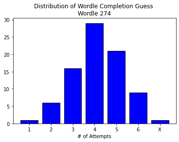

```python
import os
import tweepy

import numpy as np
import pandas as pd
from sklearn.linear_model import LogisticRegression
from sklearn.metrics import accuracy_score
from xgboost import XGBClassifier

import matplotlib.pyplot as plt
import seaborn as sns

t_consumer_key    = os.environ.get('t_consumer_key')
t_consumer_secret = os.environ.get('t_consumer_secret')
t_bearer_token    = os.environ.get('t_bearer_token')
t_access_token    = os.environ.get('t_access_token')
t_access_secret   = os.environ.get('t_access_secret')
```

# Twitter API


```python
day = 274
wordle_day = 'Wordle ' + str(day)

client = tweepy.Client(t_bearer_token)

query = wordle_day + ' -is:retweet -Türkçe'
#response = tweepy.Paginator(client.search_recent_tweets, query=query, max_results=10).flatten(limit=10)

tweets = client.search_recent_tweets(query=query, max_results=100)
```

# Parse Tweet

Guess #1  &emsp;  ⬛⬛⬛🟩⬛  &emsp;→&emsp;  1  &emsp;  green    &emsp;  0  &emsp;  yellow  <br>
Guess #2  &emsp;  🟨⬛⬛🟩⬛  &emsp;→&emsp;  1  &emsp;  green    &emsp;  1  &emsp;  yellow  <br>
Guess #3  &emsp;  🟨🟨⬛🟩⬛  &emsp;→&emsp;  1  &emsp;  green    &emsp;  2  &emsp;  yellow  <br>
Guess #4  &emsp;  ⬛🟨🟨🟩🟨  &emsp;→&emsp;  1  &emsp;  green    &emsp;  3  &emsp;  yellow  <br>
Guess #5  &emsp;  🟩🟩🟩🟩🟩  &emsp;→&emsp;  5  &emsp;  green    &emsp;  0  &emsp;  yellow  <br>
Guess #6  &emsp;  N/A &emsp;&emsp;&emsp;&emsp;&emsp;&emsp; →&emsp;N/A  &emsp;&emsp;&emsp;&emsp;    N/A


```python
def API_to_DF(tweets):
    df = pd.DataFrame(columns = ['completion', '#1_G', '#1_Y', '#2_G', '#2_Y', '#3_G', '#3_Y',
                                           '#4_G', '#4_Y', '#5_G', '#5_Y', '#6_G', '#6_Y'])
    for tweet in tweets.data:
        df = df.reindex(df.index.tolist() + list(range(df.shape[0], df.shape[0]+1)))

        # find the (start, end) of grid and extract grid
        temp = [tweet.text.find('⬛'),tweet.text.find('⬜'),tweet.text.find('🟨'),tweet.text.find('🟩')]
        if sum(temp) == -4:
            pass
        else:
            l = min([i for i in temp if i >= 0])
        r = max(tweet.text.rfind('⬛'), tweet.text.rfind('⬜'), tweet.text.rfind('🟨'), tweet.text.rfind('🟩'))
        grid = tweet.text[l: r+1]

        # grid max: 6*6=36. ignore tweets that have added additional wordle boxes
        if (len(grid) +1) <= 36:

            # store attempt in which the wordle was completed
            df.iloc[-1, 0] = tweet.text[tweet.text.find('/6') - 1]

            # parse through each guess of the wordle grid. tally green and yellow quantities
            col = 1
            guess_start = 0
            grid_len = len(grid)

            while guess_start < grid_len:        
                guess = grid[guess_start: guess_start+5]

                df.iloc[-1, col]   = guess.count('🟩')
                df.iloc[-1, col+1] = guess.count('🟨') 

                col += 2
                guess_start += 6
                
    df = df[df['#1_G'].notnull()]
    df = df.astype({'#1_G':'float64','#1_Y':'float64','#2_G':'float64','#2_Y':'float64','#3_G':'float64','#3_Y':'float64',
                    '#4_G':'float64','#4_Y':'float64','#5_G':'float64','#5_Y':'float64','#6_G':'float64','#6_Y':'float64',
                    'completion':'category'})
    return df

# train-test split
df = API_to_DF(tweets)
split = int(0.80*df.shape[0])
trn = df.iloc[:split, :]
tst = df.iloc[split:, :]
```


```python
counts = df['completion'].value_counts().reindex(['1','2','3','4','5','6','X'], fill_value = 0 )

plt.bar(counts.index.values, height=counts.values, color='blue', edgecolor='black')
plt.title('Distribution of Wordle Completion Guess \n' + wordle_day)
plt.xlabel('# of Attempts')
```


    Text(0.5, 0, '# of Attempts')


    

    


```python
def jitter(x, jitter):
    return x + np.random.normal(loc=0, scale=jitter, size=x.shape)

sns.set(rc={'axes.facecolor':'lightgray', 'figure.figsize':(5,5)})
palette = {'1':'#33cc33', '2':'#29a329', '3':'#248f24', '4':'#1f7a1f', '5':'#145214', '6':'#0f3d0f', 'X':'#000000'}
hue_order = ['1','2','3','4','5','6','X']

plot = sns.scatterplot(x=jitter(df['#1_G'], 0.08), y=jitter(df['#1_Y'], 0.08), 
                       hue=df['completion'], palette=palette, hue_order=hue_order, s=150)

plot.set_xlabel('Guess 1 - # Green', fontsize=12)
plot.set_ylabel('Guess 1 - # Yellow', fontsize=12)
plot.set_title('Starting Word Quality and Outcome', fontsize=16)

plt.xticks([0,1,2,3,4,5])
plt.yticks([0,1,2,3,4,5])
plt.show(plot)
```


    

    


# Multiclass Logistic Regression


```python
lr = LogisticRegression(multi_class='multinomial')

y_trn = trn['completion']
x_trn = trn[['#1_G','#1_Y']]

y_tst = tst['completion']
x_tst = tst[['#1_G','#1_Y']]

lr.fit(x_trn, y_trn)

y_trn_hat = lr.predict(x_trn)
print('Train Accuracy: ', round(100*accuracy_score(y_trn, y_trn_hat), 2), '%')


y_tst_hat = lr.predict(x_tst)
print('Test Accuracy: ', round(100*accuracy_score(y_tst, y_tst_hat), 2), '%')
```

    Train Accuracy:  37.88 %
    Test Accuracy:  41.18 %
    


```python
print('Completion predictions given quality of first guess')
print('Y | 0G, 0Y: ', lr.predict(pd.DataFrame([{'#1_G':0, '#1_Y':0}]))[0], 'guesses')
print('Y | 1G, 0Y: ', lr.predict(pd.DataFrame([{'#1_G':1, '#1_Y':0}]))[0], 'guesses')
print('Y | 1G, 1Y: ', lr.predict(pd.DataFrame([{'#1_G':1, '#1_Y':1}]))[0], 'guesses')
print('Y | 2G, 1Y: ', lr.predict(pd.DataFrame([{'#1_G':2, '#1_Y':1}]))[0], 'guesses')
print('Y | 3G, 0Y: ', lr.predict(pd.DataFrame([{'#1_G':3, '#1_Y':0}]))[0], 'guesses')
print('Y | 5G, 0Y: ', lr.predict(pd.DataFrame([{'#1_G':5, '#1_Y':0}]))[0], 'guesses')

print('\nNonsensical Results:')
print('Y | 4G, 0Y: ', lr.predict(pd.DataFrame([{'#1_G':4, '#1_Y':0}]))[0], 'guesses')
print('Y | 4G, 1Y: ', lr.predict(pd.DataFrame([{'#1_G':4, '#1_Y':1}]))[0], 'guesses')
```

    Completion predictions given quality of first guess
    Y | 0G, 0Y:  5 guesses
    Y | 1G, 0Y:  4 guesses
    Y | 1G, 1Y:  4 guesses
    Y | 2G, 1Y:  3 guesses
    Y | 3G, 0Y:  4 guesses
    Y | 5G, 0Y:  1 guesses
    
    Nonsensical Results:
    Y | 4G, 0Y:  1 guesses
    Y | 4G, 1Y:  3 guesses
    

# XGBoost


```python
# one-hot encoding of the categorical
#x_trn_e = pd.get_dummies(x_trn, columns=['completion'])
#y_trn_e = pd.get_dummies(y_trn, columns=['completion'])
```


```python
bst = XGBClassifier(objective='multi:softmax')
bst.fit =(x_trn, y_trn)
bst.predict(x_tst)
```
